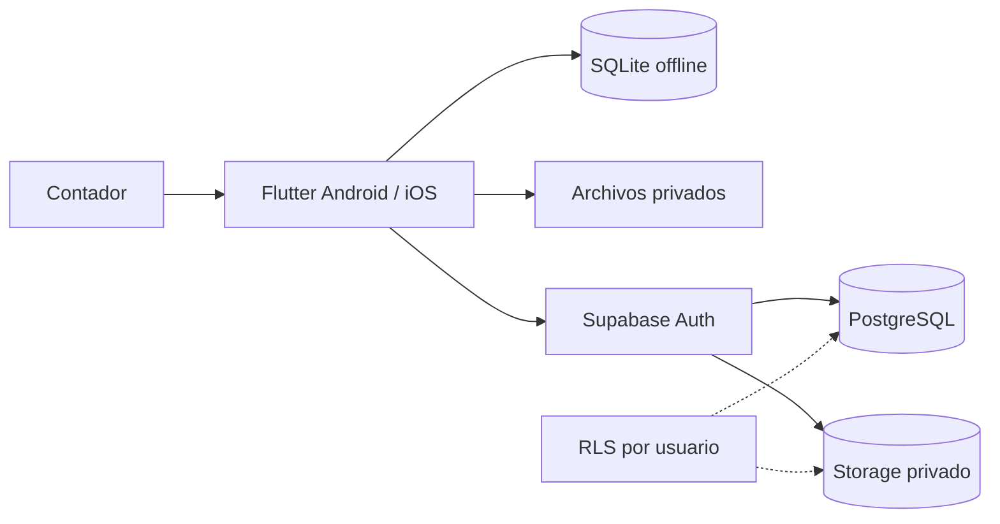

# ContaPlazo

Aplicación móvil multiplataforma para que contadores gestionen clientes, vencimientos de declaraciones de renta, documentos, honorarios y estados de cuenta desde un solo lugar.

## Problema y solución

El seguimiento manual mediante hojas de cálculo, chats y carpetas separadas aumenta el riesgo de olvidar fechas, perder soportes y desconocer la cartera pendiente. ContaPlazo centraliza el expediente de cada cliente, presenta alertas visuales y mantiene la operación disponible aun sin conexión.

## Funcionalidades

- Dashboard de declaraciones pendientes, vencimientos, recaudo y cartera.
- Registro y edición de clientes, fechas, honorarios y estados.
- Control de pagos y saldos por cliente.
- Perfil profesional del contador.
- Carga, apertura y eliminación confirmada de PDF, imágenes, Word y Excel.
- Persistencia local con SQLite y almacenamiento privado.
- Sincronización con Supabase PostgreSQL y Storage.
- Seguridad por usuario mediante Supabase Auth y Row Level Security.

## Arquitectura



La explicación completa está en [docs/architecture.md](docs/architecture.md). La aplicación funciona localmente sin credenciales y habilita la nube al recibir `SUPABASE_URL` y `SUPABASE_PUBLISHABLE_KEY`.

## Tecnologías

- Flutter y Dart.
- SQLite mediante `sqflite`.
- Supabase Flutter: Auth, PostgreSQL, API de datos y Storage.
- `file_picker`, `path_provider` y `open_filex` para documentos.

## Ejecución local

```bash
flutter pub get
flutter run
```

## Despliegue de Supabase

1. Crear un proyecto gratuito en [Supabase](https://supabase.com/dashboard).
2. Activar **Authentication > Sign In / Providers > Anonymous**.
3. Ejecutar [`supabase/migrations/202609010001_initial_schema.sql`](supabase/migrations/202609010001_initial_schema.sql) desde **SQL Editor**.
4. Copiar `supabase_config.example.json` como `supabase_config.json` y completar los datos públicos del panel **Connect**.
5. Ejecutar:

```bash
flutter run --dart-define-from-file=supabase_config.json
```

Para generar el APK conectado a la nube:

```bash
flutter build apk --release --dart-define-from-file=supabase_config.json
```

La clave `service_role` es secreta y nunca debe incluirse ni publicarse.

## Verificación

```bash
flutter analyze
flutter test
flutter build apk --debug
```

## Presentación y evidencias

- Presentación final: [PowerPoint](docs/presentation/ContaPlazo_Presentacion_Final.pptx) y [PDF](docs/presentation/ContaPlazo_Presentacion_Final.pdf).
- Capturas de funcionamiento: [`docs/evidence/`](docs/evidence/).
- El APK se genera localmente en `build/app/outputs/flutter-apk/` y no se versiona.

## Estructura

```text
lib/                    Código Flutter y repositorios de datos
supabase/migrations/    Esquema SQL, bucket y políticas RLS
docs/diagrams/          Diagrama de arquitectura
docs/evidence/          Evidencias de funcionamiento
docs/presentation/      Presentación final PPTX/PDF
test/                   Pruebas automatizadas
```

## Repositorio público

https://github.com/NetSysFX/ContaPlazo
